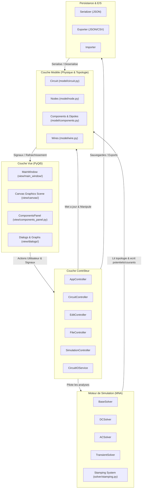
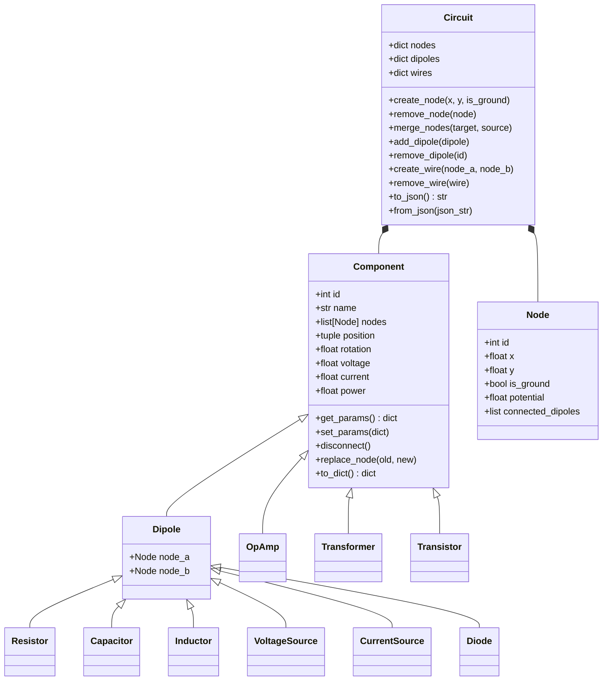
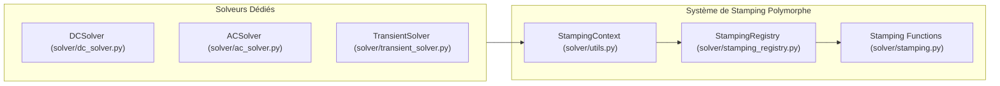

# Architecture Technique - Nodal Circuit Simulator

Nodal est une application de simulation et d'analyse de circuits électriques linéaires et non-linéaires en régimes continu (DC), sinusoïdal permanent (AC) et transitoire temporel. L'application repose sur une architecture modulaire en **Modèle-Vue-Contrôleur (MVC)** avec résolution nodale modifiée polymorphe (**MNA**).

---

## 1. Vue d'Ensemble & Architecture Globale (MVC)

L'architecture du projet est organisée selon le pattern MVC strict pour séparer la physique électrique, la logique métier et l'interface graphique utilisateur.



---

## 2. Couche Modèle (`model/`)

La couche modèle représente la topologie électrique et les grandeurs physiques sans aucune dépendance visuelle à Qt.



### Classes Clés :
- **[`Component`](file:///model/component.py)** : Classe de base abstraite universelle pour les composants à $N$ bornes (dipôles, AOP 3 bornes, transistors 3 bornes, transformateurs 4 bornes).
- **[`Dipole`](file:///model/dipole.py)** : Spécialisation à 2 bornes exposant `node_a` et `node_b`.
- **[`Node`](file:///model/node.py)** : Point d'interconnexion équipotentiel portant les coordonnées et le potentiel électrique calculé ($V$).
- **[`Wire`](file:///model/wire.py)** : Connexion équipotentielle entre deux nœuds du circuit.
- **[`Circuit`](file:///model/circuit.py)** : Agrégateur principal contenant les nœuds, dipôles et liaisons, avec gestion de fusion de nœuds et sérialisation.

---

## 3. Moteur de Simulation & Stamping Polymorphe (`solver/`)

Le moteur de résolution repose sur l'analyse nodale modifiée (**MNA** - *Modified Nodal Analysis*) et résout le système linéaire :
$$\mathbf{A} \cdot \mathbf{x} = \mathbf{Z}$$

```
┌────────────────────────────────────────────────────────┐
│               SYSTEME MNA D'EQUATIONS                  │
├────────────────────────────────────────────────────────┤
│  [  G     B  ]   [  v  ]   [  i  ]                     │
│  [           ] * [     ] = [     ]                     │
│  [  C     D  ]   [  j  ]   [  e  ]                     │
└────────────────────────────────────────────────────────┘
```
- $\mathbf{G}$ : Matrice de conductance nodale ($N \times N$).
- $\mathbf{B}$ / $\mathbf{C}$ : Matrices d'incidence des sources de tension et composants dépendants ($N \times M$ et $M \times N$).
- $\mathbf{D}$ : Matrice de dépendance entre sources ($M \times M$).
- $\mathbf{v}$ : Vecteur des potentiels nodaux inconnus.
- $\mathbf{j}$ : Vecteur des courants traversant les sources de tension.
- $\mathbf{i}$ / $\mathbf{e}$ : Vecteurs des courants injectés et des tensions imposées.

### Architecture Polymorphe des Solveurs :



1. **[`DCSolver`](file:///solver/dc_solver.py)** : Résolution en régime continu DC (statique et itérations Newton-Raphson avec amortissement pour composants non-linéaires comme les diodes/LED).
2. **[`ACSolver`](file:///solver/ac_solver.py)** : Analyse fréquentielle petit signal complexe avec phaseurs ($j\omega C$, $j\omega L$) et balayage harmonique (Bode, impédance).
3. **[`TransientSolver`](file:///solver/transient_solver.py)** : Intégration temporelle Euler implicite / Trapèze avec modèles compagnons pour condensateurs ($G_{eq}=C/\Delta t$, $I_{eq}=G_{eq} v_0$) et inductances ($G_{eq}=\Delta t/L$, $I_{eq}=i_0$).

---

## 4. Couche Contrôleur & Services (`controller/`)

La couche contrôleur centralise la logique applicative et orchestre les flux entre la vue et le modèle :

- **[`AppController`](file:///controller/app_controller.py)** : Gestion globale de l'application, thèmes, statut, boîte de dialogue À propos, gestion des raccourcis.
- **[`CircuitController`](file:///controller/circuit_controller.py)** : Opérations sur le canevas (zoom, centrage, grille, aimantation, visibilité des nœuds).
- **[`EditController`](file:///controller/edit_controller.py)** : Édition géométrique, sélection, copier/couper/coller, miroirs X/Y, alignements, distributions et pile Undo/Redo.
- **[`FileController`](file:///controller/file_controller.py)** : Flux de fichiers (nouveau, ouvrir, enregistrer, enregistrer sous, exports).
- **[`SimulationController`](file:///controller/simulation_controller.py)** : Pilotage des simulations (lancement DC/AC/Transitoire, buffers temps-réel, affichage des oscilloscopes).
- **[`CircuitIOService`](file:///controller/io_service.py)** : Service découplé pour la persistance JSON et exports CSV.

---

## 5. Couche Vue Modulaire (`view/`)

La couche vue a été découpée en sous-packages modulaires pour éviter les fichiers monolithiques :

```
view/
├── canvas/                      # Moteur graphique du schéma
│   ├── canvas_scene.py          # Scène QGraphicsScene principale
│   ├── canvas_view.py           # Vue QGraphicsView (zoom, pan, interactions)
│   ├── canvas_snap.py           # Aimantation géométrique et angulaire (SnapManager)
│   ├── canvas_clipboard.py      # Presse-papier et historique (ClipboardManager)
│   ├── canvas_selection.py      # Déplacements et rotations (SelectionManager)
│   └── canvas_editing.py        # Instanciation de composants (EditingManager)
├── main_window/                 # Fenêtre principale et barres d'outils
│   ├── window.py                # MainWindow assemblée
│   ├── toolbars.py              # Barres d'outils (Standard, Outils, Simulation)
│   ├── menus.py                 # Barres de menus (Fichier, Édition, Affichage...)
│   └── status_bar.py            # Barre d'état dynamique
├── dialogs/                     # Boîtes de dialogue
│   ├── simulation_dialogs.py    # Configuration DC / AC Sweep / Transitoire
│   ├── settings_dialogs.py      # Préférences et options graphiques
│   └── component_dialogs.py     # Édition des paramètres de composants
└── components_panel.py          # Palette latérale de composants avec cache d'icônes
```

---

## 6. Patterns de Conception Utilisés

| Pattern | Rôle dans le projet | Modules concernés |
| :--- | :--- | :--- |
| **MVC** | Séparation claire Modèle / Vue / Contrôleur | `model/`, `view/`, `controller/` |
| **Strategy & Stamping Polymorphe** | Chaque composant sait s'estamper dans la matrice MNA selon le régime | `solver/stamping.py`, `solver/stamping_registry.py` |
| **Command & Memento** | Historique Undo/Redo basé sur des instantanés d'état JSON | `view/canvas/canvas_clipboard.py`, `controller/edit_controller.py` |
| **Flyweight & Cache** | Mise en cache mémoire des icônes et pixmaps pour fluidité UI | `view/components_panel.py` |
| **Observer (Qt Signals/Slots)** | Notification asynchrone des modifications et résultats de simulation | `controller/`, `view/` |
| **Service Layer** | Abstraction des opérations d'E/S et sérialisation | `controller/io_service.py`, `persistence/` |